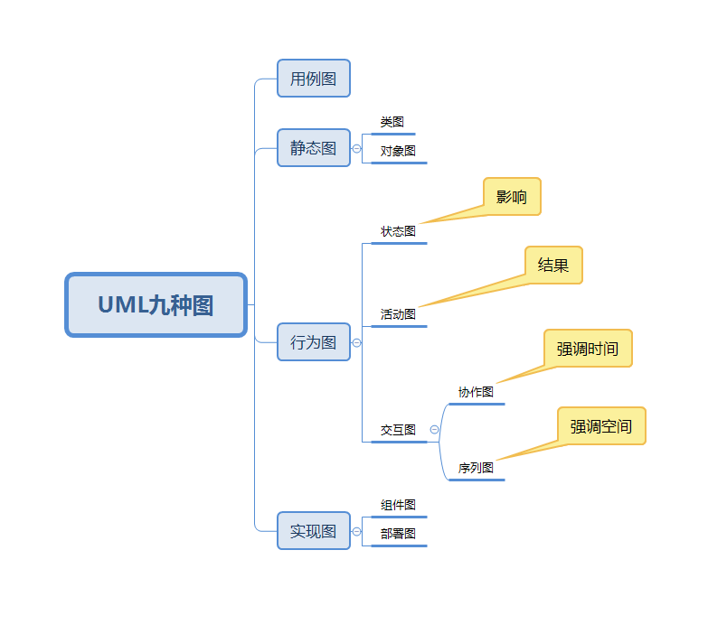

# UML 相关知识

## UML 九种图说明

### 用例图(&diams;&diams;&diams;&diams;&diams;)

- 由參与者、用例以及它们之间的关系构成的用于描写叙述系统功能的动态视图。是分析系统有哪些功能以及明白系统内部和系统外部（角色）的交互的。

### 类图(&diams;&diams;&diams;&diams;&diams;)

- 显示出类、接口以及它们之间的静态结构和关系。它用于描写叙述系统的结构化设计。

### 对象图(&diams;&diams;)

- 显示了一组对象和它们之间的关系。与类图相似。对象图显示类的多个对象实例。而不是实际的类。一个对象图是类图的一个实例。

### 状态图(&diams;&diams;&diams;&diams;&diams;)

- 用于描写叙述一个对象在其生存期间的动态行为，表现对象响应时间所经历的状态序列以及伴随的动作。

### 活动图(&diams;&diams;&diams;&diams;&diams;)

- 活动图是状态图的一种特殊形式。着重描写叙述操作（方法）实现中所完毕的工作以及用例实例或对象中的活动，它是状态图的一个变种。

### 协作图(&diams;&diams;)

- 是一种交互图。强调的是发送和接受消息对象之间的组织关系。表达对象间的交互过程及对象间的关联关系。

### 序列图(&diams;&diams;&diams;&diams;&diams;)

- 序列图主要用于交互发生一系列顺序，显示对象之间的交互。它通过描写叙述对象之间发送消息的时间顺序显示多个对象之间的动态协作。

### 组件图(&diams;&diams;&diams;&diams;&diams;)

- 描写叙述了软件的各种组件和它们之间的依赖关系。组件图中通常包括 3 中元素：组件（Component）、接口（Interface）和依赖（Dependency）。

### 部署图(&diams;)

- 定义了系统中硬件的物理体系结构。用来描写叙述实际的物理设备以及他们之间的联系。

## 共同点和差别

### 状态图 VS 活动图

- 共同点：

  - 状态图和活动图都是以描写叙述系统状态转移为主。

- 差别：
  - 活动图主要描写叙述动作及对象状态改变的结果。
  - 状态图主要描写叙述的是事件对对象状态的影响。

### 序列图 VS 协作图

- 共同点：

  - 序列图和协作图都是以描写叙述对象通讯和交互为主。

- 差别：
  - 序列图强调的是时间。
  - 协作图强调的是空间。
