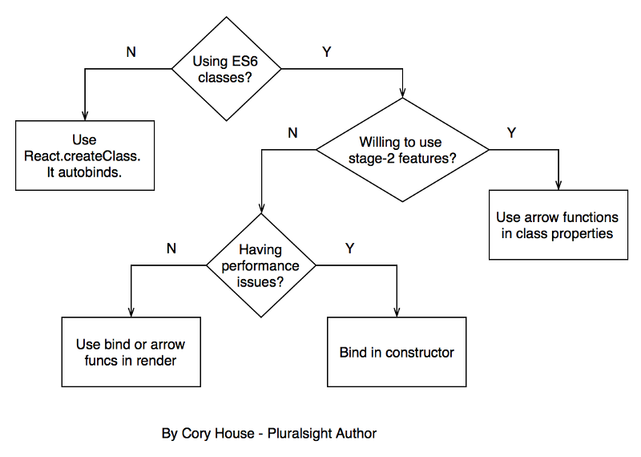

# React绑定模式：5种处理'this'的方法


原文：[React Binding Patterns: 5 Approaches for Handling \`this\`](https://medium.freecodecamp.org/react-binding-patterns-5-approaches-for-handling-this-92c651b5af56)

JavaScript中的**this**关键字的行为已经让开发者困惑很久了。


> 绑着编码真难

在React中至少有五种方法来处**this**上下文。让我们来考虑下每种方法各自的优点。

### 1. 使用React.createClass

如果你使用React.createClass，React会自动绑定函数的**this**。所有**this**关键字一定会自动指向组件实例。

```js
// 用React.createClass，这个会神奇地起作用
// 因为``this``帮你绑定好了
onChange={this.handleChange}
```

可是，随着ES6类的问世，这种非标准的创建类的方法不会是React未来想要主推的方法。事实上，在未来的版本中，createClass很可能会从React核心中抽离出去。

### 2. 在render中绑定

接下来的方法都是假设你使用ES6类来声明React组件。如果你使用了ES6类，React不再为你自动绑定this。一种解决方法是在render中调用bind函数。

```js
onChange={this.handleChange.bind(this)}
```

这种方法简洁明了，但是，由于每次渲染函数都要重新创建，因此会有性能方面的影响。这看上去很重要，但是**这种性能影响在大多数应用程序中都不太明显**。因此，出于性能原因在一开始就排除这方法话，就属于过早优化。[这里有一个例子展示了这种方法对性能的影响点在哪](https://medium.com/@esamatti/react-js-pure-render-performance-anti-pattern-fb88c101332f)。

最后，如果你遇到性能问题，[请避免在渲染中使用绑定或箭头函数](https://reactjs.org/docs/faq-functions.html#is-it-ok-to-use-arrow-functions-in-render-methods)。

### 3. 在render中使用箭头函数

这个方法和第二个方法类似。你可以在渲染函数中使用箭头函数来避免**this**上下文的改变。

```js
onChange={e => this.handleChange(e)}
```

这个方法和第二个方法一样也有潜在的性能影响。接下来的可代替的方法值得考虑，因为它们只需少量额外处理就能提供更好的性能表现。

### 4. 在构造函数中绑定

一种避免在渲染函数中绑定的方法是在构造函数中进行绑定。（另外方法将到接下来的第五点中提到）。

```js
constructor(props) {
  super(props);
  this.handleChange = this.handleChange.bind(this);
}
```

这个方法也是[React文档推荐的](https://reactjs.org/docs/faq-functions.html#how-do-i-bind-a-function-to-a-component-instance)，因为它在你的应用能有更好的性能表现。这也是我在Pluralsight上“Building Applications with React and Redux in ES6” 课程中使用的方法。

但是，在大多数应用中方法二和三对性能的影响并不明显，因此，在许多应用程序中方法二和三的可读性和可维护性优势可能超过它所带来性能问题。

但是你如果愿意使用提案第二阶段的特性，最后一个方法可能是你最想要的。

### 5. 在类属性中使用箭头函数

这个技术依赖于[类属性特性提案](https://github.com/tc39/proposal-class-public-fields)。要使用这种方法，你必须在Babel中使用[transform-class-properties](http://babeljs.io/docs/en/babel-plugin-transform-class-properties) 插件或者 [stage-2](http://babeljs.io/docs/en/babel-preset-stage-2/) 预设。

```js
handleChange = () => {
  // call this function from render 
  // and this.whatever in here works fine.
};
```

这种方法有很多优势：

1. 箭头函数的**this**是指向外层作用域的（换句话来说就是箭头函数不会改变**this**值），所以事情就自然而然地进行了。
2. 避免了方法二和三所带来的性能问题。
3. 避免了方法四的重复工作。
4. 通过将相关函数转换为箭头函数，可以直接将ES5 createClass样式重构为这方式。实际上，有[一种完全自动化的方法](https://github.com/reactjs/react-codemod#class)，可以使用codemod来处理转换。

### 总结

这个流程图总结了绑定方式的选择。



以下是所有5种方法的完整示例：

```jsx
// Approach 1: Use React.createClass
var HelloWorld = React.createClass({
  getInitialState() {
    return { message: 'Hi' };
  },

  logMessage() {
    // this magically works because React.createClass autobinds.
    console.log(this.state.message);
  },

  render() {
    return (
      <input type="button" value="Log" onClick={this.logMessage} />
    );
  }
});

// Approach 2: Bind in Render
class HelloWorld extends React.Component {
  constructor(props) {
    super(props);
    this.state = { message: 'Hi' };
  }

  logMessage() {
    // This works because of the bind in render below.
    console.log(this.state.message);
  }

  render() {
    return (
      <input type="button" value="Log" onClick={this.logMessage.bind(this)} />
    );
  }
}

// Approach 3: Use Arrow Function in Render
class HelloWorld extends React.Component {
  constructor(props) {
    super(props);
    this.state = { message: 'Hi' };
  }

  logMessage() {
    // This works because of the arrow function in render below.
    console.log(this.state.message);
  }

  render() {
    return (
      <input type="button" value="Log" onClick={() => this.logMessage()} />
    );
  }
}

// Approach 4: Bind in Constructor
class HelloWorld extends React.Component {
  constructor(props) {
    super(props);
    this.state = { message: 'Hi' };
    this.logMessage = this.logMessage.bind(this);
  }

  logMessage() {
    // This works because of the bind in the constructor above.
    console.log(this.state.message);
  }

  render() {
    return (
      <input type="button" value="Log" onClick={this.logMessage} />
    );
  }
}

// Approach 5: Arrow Function in Class Property
class HelloWorld extends React.Component {
  // Note that state is a property,
  // so no constructor is needed in this case.
  state = {
    message: 'Hi'
  };

  logMessage = () => {
    // This works because arrow funcs adopt the this binding of the enclosing scope.
    console.log(this.state.message);
  };

  render() {
    return (
      <input type="button" value="Log" onClick={this.logMessage} />
    );
  }
}
```