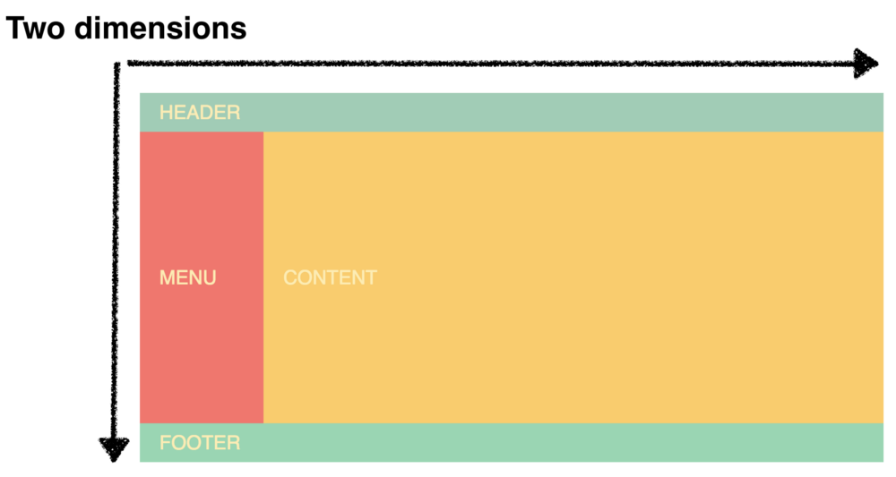
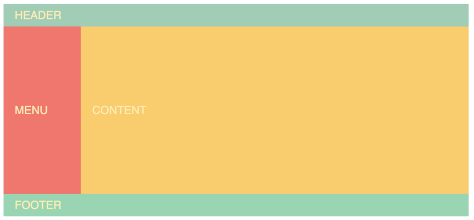
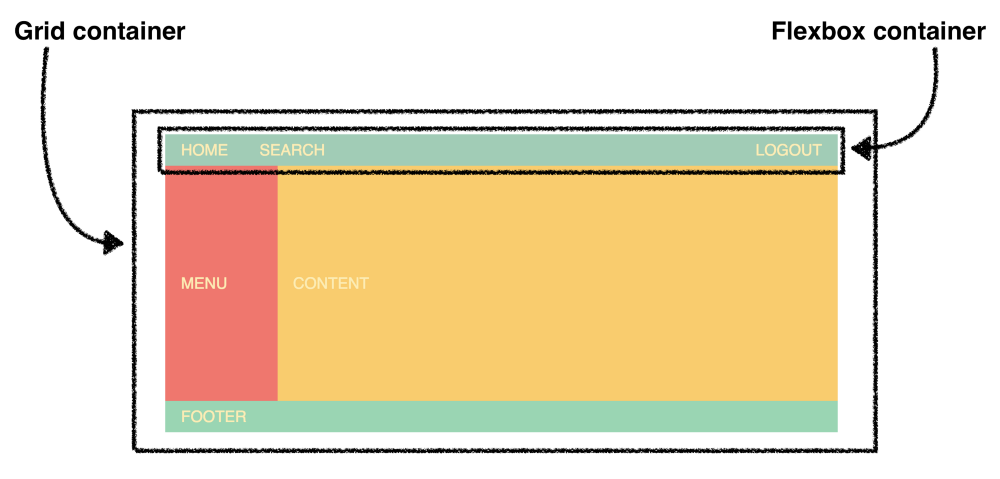

# CSS终极之战：Grid VS Flexbox

[原文](https://hackernoon.com/the-ultimate-css-battle-grid-vs-flexbox-d40da0449faf)

*学习它们之间的不同，以及何时你应该使用另外一种。*

在过去几年中，CSS Flexbox在前端开发中变得非常流行。这并不奇怪，因为它让我们创建动态布局和在容器中居中内容变得更加简单。

然而，CSS中又来了个叫Grid的东西，它有很多和Flexbox相同的能力。在一些情况中它优于Flexbox，另一些情况下又并没有。

这似乎是开发者困惑的来源。因此，本文在宏观和微观方面对两个模块进行了比较。

> 如果你想正确地学习这两个模块，请查看我的免费课堂[CSS Grid](https://scrimba.com/g/gR8PTE)和[CSS Flexbox](https://scrimba.com/g/gflexbox)

现在让我们开始吧

## 一维 VS 二维

如果你想从这篇文章中学习到一个重点，那就是这个了：

> **Flexbox用于一维布局，Grid用于二维布局。**

这意味着如果你想在一个方向上布局一些东西的话（例如页面头部的三个按钮），你应该使用Flexbox


比起CSS Grid来，它的灵活性话更强。它也更容易维护和需要的代码更少。

然而，如果你是要创建包含行列的整个二维布局，这时你应该使用CSS Grid。



这种情况下，CSS Grid更加灵活，让你的创建更简单，代码将更容易维护。

现在你当然可以结合两者来使用。

在上面的示例中，最好使用Grid进行页面布局，然后使用Flexbox来对齐页面头部的内容。这是最佳实践。我会在本文结尾告诉你具体怎么做。

## 内容优先 VS 布局优先

另外一个两者之间的核心差异是Flexbox是以**内容**为基础，而Grid是以**布局**为基础。这可能有点抽象，所以让我们来看个具体的例子，它能让这句话更容易理。
解。

我们会使用上一段内容中提到的页面头部。HTML如下：

```html
<header>
    <div>Home</div>
    <div>Search</div>
    <div>Logout</div>
</header>
```

在我们将它变成Flexbox布局之前，这些div会像这样堆叠在一起


> 我添加了一些基本样式，这与Flexbox或Grid无关，所以我就不展示这些了。

### FlexBox 页面头部

然而，当我们给了它``display: flex;``后，这些子项就会很好的排列在一行上。

```css
header {
    display: flex;
}
```


为了把*logout*按钮移动到远端右边，我们要获取到这个元素并给它一个左边距：

```css
header > div:nth-child(3) {
    margin-left: auto;
}
```

最后效果如下：


这边可以注意的是，这些子项的放置位置是由它们本身决定。我们没有预先定义除了``display: flex;``之外的任何东西

这是Flexbox和Grid之间核心差异，当我们使用Grid重新创建页面头部时，它将更加明显。

_尽管CSS Grid不是为了创建一维的头部页面而开发的，但在本文中它仍然是一个很好的练习，因为它教会了我们Flexbox和Grid之间的核心差异。_

### Grid 页面头部

我们可以使用CSS Grid以几种不用方式来创建页面头部。我要用一个非常直截了当的方法，我们的网格有十个列，每个列都是一个分数单位宽。

```css
header {
    display: grid;
    grid-template-columns: repeat(10, 1fr);
}
```

它看上去和Flexbox方法产生的效果一样.


但是，我们在底层看到它们的不同。我们将使用Chrome检查器来查看网格列线。


这种方法的主要区别在于我们必须首先定义网格布局的列。我们先定义每列的宽度，然后把内容放入可用的网格单元中。

_这种方法强制我们把页面头部划分为我们想要的列数。_

除非我们改变网格，否则我们只能使用这十列。在Flexbox中我们就不会受到此类限制。

为了把*logout*展示在远端右边，我们把它放在第十列中，就像这样：

```css
header > div:nth-child(3) {
    grid-column: 10;
}
```

当我们检查网格时，它就展示成这样了。


我们不能简单给它一个`margin-left: auto;`因为*logout*按钮已经放置在了布局中的具体的网格单元，在第十列。要移动它，只能为它定义一个其他单元格。

## 结合两者

现在来看下如何把这两者结合在以前，将我们的头部合并到页面布局中。我们将从网站布局开始。



HTML如下：

```html
<div class="container">
  <header>HEADER</header>
  <aside>MENU</aside>
  <main>CONTENT</main>
  <footer>FOOTER</footer>
</div>
```

CSS如下：

```css
.container {
    display: grid;    
    grid-template-columns: repeat(12, 1fr);
    grid-template-rows: 50px 350px 50px;
}
```

我们把容器中的元素放入网格中，就像下面这样：

```css
header {
    grid-column: span 12;
}
aside {
    grid-column: span 2;
}
main {
    grid-column: span 10;
}
footer {
    grid-column: span 12;
}
```

现在我们简单地加上头部。我们会把页面头部设置为一个flexbox容器，同时它是CSS Grid的一项。

```css
header {
    display: flex;
}
```

现在我们可以设置`logout`按钮到右边：
```css
header > div:nth-child(3) {
    margin-left: auto;
}
```

我们使用Grid和Flexbox完成了一个完美的布局。这里是两个容器的表现：



所以现在你应该对Flexbox和Grid之间的一般和特定差异有一个很好的理解，并且知道如何一起使用它们。

## 浏览器支持

在结束之前，我也需要提一下浏览器支持。在写这篇文章之前，77%的全球网站支持CSS Grid，同时它仍在上升。

我相信2018会是CSS Grid的一年。它将获得突破，并将成为前端开发人员必备的技能。就像过去几年的CSS Flexbox发生的情况一样。
